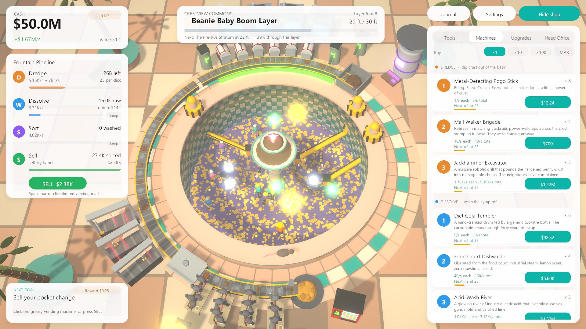

# Wish Extractor: Mall Fountain Tycoon

A Unity (6000.4.2f1) incremental tycoon game. You start at the bottom of a dry, 30-foot mall fountain
packed with forty years of pennies, gum and calcified mall, armed with a piece of chewed bubblegum on a
string. Dig it out, wash off the syrup, sort the treasure from the zinc, sell it at a greasy vending
machine, and keep buying bigger machines until the whole fountain runs itself. Then sign with a bigger
mall and do it again.



## Play

- **Windows build:** `Builds/Windows/WishExtractor.exe` (windowed 1600×900, resizable). No install needed.
- **Unity:** open this folder in Unity 6000.4.2f1 and press Play in `Assets/Scenes/Main.unity`
  (the whole game builds itself at runtime from code, so the scene is almost empty).

The Windows build is not committed; rebuild it with the command below.

### Controls

| Input | Action |
|---|---|
| Left click the crust | Dig (hold to keep digging) |
| Left click a glowing orb | Catch a True Wish before it floats away |
| Left click a golden penny / the mall rat | Bonus effects / a guaranteed relic |
| Left click a machine | Whack it for a small burst of output |
| Left click the red vending machine, or **Space** | Sell your pocket |
| Right-drag or **Q/E** | Orbit the camera |
| Scroll | Zoom |
| **WASD** / middle-drag | Pan · **R** resets the view |
| **1–4** | Shop tabs · **B** cycles buy amount (×1/×10/×100/Max) |
| **Tab** | Hide/show the shop · **J** journal · **Esc** settings |

Progress autosaves every 30 seconds and on quit (`%USERPROFILE%\AppData\LocalLow\Nico Macaraig\Wish Extractor\wishextractor_save.json`).
Offline progress runs for up to 2 hours at 50% efficiency (Head Office perks raise both).

## How long is it?

Measured with the balance simulator (a bot playing the real game rules, see below):

| Player profile | Six malls (the campaign) |
|---|---|
| Engaged, efficient bot (clicks, catches 55% of wishes, buys optimally every second) | **24h 29m** |
| Idle-leaning bot (barely clicks, catches 15% of wishes) | **40h 55m** |

After the sixth mall the game continues forever with Remodel contracts (every mall again, bigger and
richer, about 1–3 hours per mall). Collections (107 wishes, 72 relics, 71 achievements) add more.

## Build

```bash
"C:\Program Files\Unity\Hub\Editor\6000.4.2f1\Editor\Unity.exe" -batchmode -nographics -projectPath . -executeMethod WishExtractor.EditorTools.ProjectBuilder.BuildWindowsCI -logFile Logs/build.log
```

Or in the editor: **Wish Extractor → 2. Build Windows Player**. The build step also (re)creates
`Assets/Scenes/Main.unity` and applies player settings (linear colour, windowed, no splash).

## Self-tests in the player

| Flag | What it does |
|---|---|
| `-autotour -shots <dir>` | Plays a scripted tour through every mall and saves ~20 screenshots, then quits |
| `-uitest -savefile <name> -fresh` | Drives the real uGUI/raycast input path through 39 checks (dig, sell, buy, journal, settings, contract, Head Office) and logs PASS/FAIL |
| `-loadtest -savefile <name> -pretendaway <sec>` | Loads a save as if you'd been away, logs the restored state and the offline report |
| `-savefile <name>` / `-fresh` | Use a different save file / erase it first |
| `-dev` | Debug keys: F5 cash, F6 finish mall, F7 dig +10%, F8 golden penny, F9 wish storm |

Example (screenshots land in `Screenshots/`):

```bash
Builds/Windows/WishExtractor.exe -autotour -shots Screenshots -screen-fullscreen 0 -screen-width 1920 -screen-height 1080
```

## Balance simulator

`Tools/BalanceSim` is a .NET 10 console app that compiles the game's pure C# rules
(`Assets/Scripts/Core`) together with a bot player.

```bash
dotnet run -c Release --project Tools/BalanceSim -- 40 1234 engaged
```

```bash
dotnet run -c Release --project Tools/BalanceSim -- fit --apply
```

The first prints per-mall and per-stratum clear times, purchase cadence and the longest gap between
purchases (`report_<profile>.txt`). The second re-fits every stratum boundary (and the first Remodel
lap) from the bot's actual trajectory and writes them into `ContentMalls.cs`; run it after any change
to prices, rates or multipliers. `counts` prints content totals.

See `DESIGN.md` for the game design and `HANDOFF.md` for current state and next steps.
